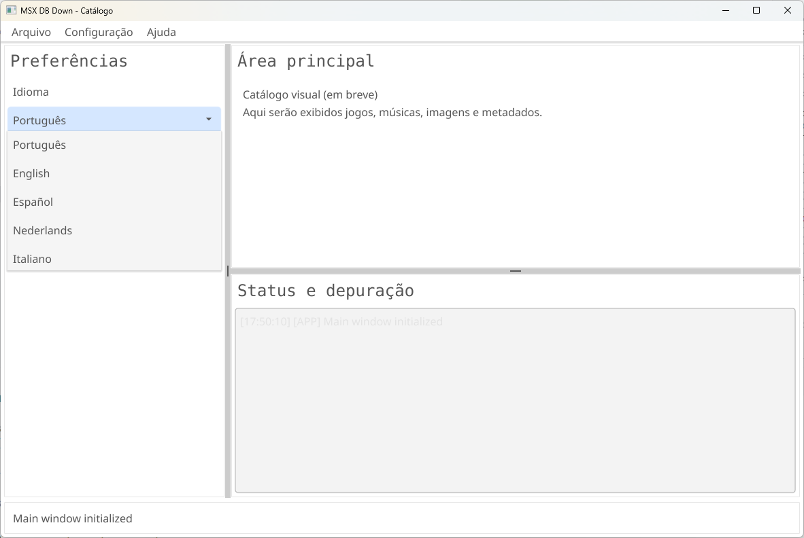

# MSX DB Down

Frontend desktop para catalogo MSX, escrito em Go, com GUI em Fyne.



## Navegacao rapida

- [MANUAL](MANUAL.md) - guia completo de download, build, execucao e CLI
- [REFERENCE](REFERENCE.md) - resumo rapido (5 idiomas) de funcoes, menu e atalhos
- [OUTLINE](OUTLINE.md) - handoff tecnico detalhado para continuidade
- [CHANGELOG](CHANGELOG.md) - historico por versao

## Versao atual

- **App version**: `0.0.3`
- **Build metadata**: injetado no build (`BuildDate`, `BuildTime`, `BuildNumber` em hexadecimal UTC)

## Ambientes e ferramentas usadas

### Ambientes de desenvolvimento

- **Windows 11** com **PowerShell**
- **Fedora 44** com **ZSH**

### Toolchain e stack

- **Go**
- **CGO / GCO** (necessario para parte da stack grafica e builds com Fyne)
- **GCC**
- **Fyne** (GUI)
- **Cobra** (CLI)
- **SQLite** (persistencia de configuracoes e futuro catalogo)
- **openMSX** (alvo de integracao como frontend de emulador)
- **Git**
- **GitHub**
- **GoLand**

## O que ja esta pronto

- Janela principal moderna (painel lateral + area principal + painel de log)
- Barra de status inferior
- Menu funcional:
  - `File -> Exit`
  - `Setup -> Config UI`
  - `Help -> About`
- Dialogo **Config UI**:
  - familia da fonte
  - tamanho da fonte
  - densidade do layout
- Dialogo **About** com:
  - versao, build, data/hora
  - copyrights
  - link clicavel para `www.cybernostra.com`
- Internacionalizacao de UI em 5 idiomas:
  - Portugues (`pt`)
  - English (`en`)
  - Espanol (`es`)
  - Nederlands (`nl`)
  - Italiano (`it`)
- CLI com Cobra e help localizado por `--lang`
- Persistencia de configuracoes em SQLite (`settings.db`):
  - idioma
  - tema
  - fonte/tamanho
  - densidade
- Fallback de idioma na primeira execucao (sem valor salvo): **English**

## Estrutura principal

- `main.go` - bootstrap da app, menus, i18n, integracao UI/CLI
- `version.go` - variaveis de versao/build injetadas via `ldflags`
- `build.ps1` - build script para Windows/Linux
- `internal/about/` - dialogo About
- `internal/configui/` - dialogo Config UI
- `internal/settingsdb/` - persistencia SQLite de settings
- `internal/uiprefs/` - defaults e normalizacao de preferencias
- `internal/uitheme/` - tema customizado da GUI
- `OUTLINE.md` - resumo de handoff completo do projeto

## Dependencias principais

- `fyne.io/fyne/v2`
- `github.com/spf13/cobra`
- `modernc.org/sqlite`

## Como executar

### Windows (PowerShell)

```powershell
Set-Location "C:\dos\msxdbdown"
go run .
```

### Fedora 44 (ZSH)

```bash
cd /caminho/para/msxdbdown
go run .
```

## CLI (exemplos)

```powershell
Set-Location "C:\dos\msxdbdown"
go run . --lang pt --help
go run . version
```

## Testes

```powershell
Set-Location "C:\dos\msxdbdown"
go test ./internal/settingsdb -v
go test ./internal/uiprefs -v
go build ./...
```

> Nota: `go test ./...` pode levar mais tempo, pois compila mais pacotes da stack grafica.

## Build de release/debug

### Windows (PowerShell)

```powershell
Set-Location "C:\dos\msxdbdown"
.\build.ps1 -Windows -Release -Version "0.0.3"
```

```powershell
Set-Location "C:\dos\msxdbdown"
.\build.ps1 -Windows -DebugBuild -Version "0.0.3" -Run -RunArgs "version"
```

## Proximos passos (roadmap)

1. Implementar downloader das duas fontes principais
2. Definir schema SQLite para catalogo (alem de settings)
3. Implementar matching/normalizacao de nomes entre bases
4. Integrar coleta de metadados externos (imagem, video, musica etc.)
5. Conectar catalogo visual ao launcher do openMSX

